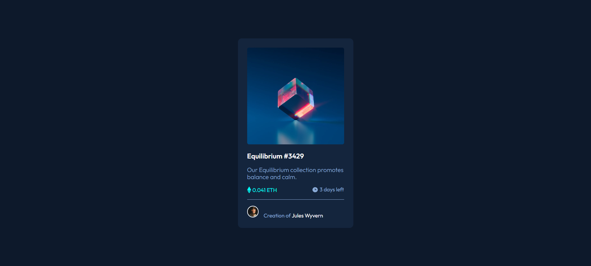

# Frontend Mentor - NFT preview card component solution

This is a solution to the [NFT preview card component challenge on Frontend Mentor](https://www.frontendmentor.io/challenges/nft-preview-card-component-SbdUL_w0U). Frontend Mentor challenges help you improve your coding skills by building realistic projects.

## Table of contents

- [Frontend Mentor - NFT preview card component solution](#frontend-mentor---nft-preview-card-component-solution)
  - [Table of contents](#table-of-contents)
  - [Overview](#overview)
    - [The challenge](#the-challenge)
    - [Screenshot](#screenshot)
    - [Links](#links)
  - [My process](#my-process)
    - [Built with](#built-with)
    - [What I learned](#what-i-learned)
    - [Continued development](#continued-development)
    - [Useful resources](#useful-resources)
  - [Author](#author)

## Overview

### The challenge

Users should be able to:

- View the optimal layout depending on their device's screen size
- See hover states for interactive elements

### Screenshot



### Links

- [Solution URL](https://github.com/pasqualegiorgio/frontend-mentor-nft-preview-card-component)
- [Live Site URL](https://pasqualegiorgio.github.io/frontend-mentor-nft-preview-card-component/)

## My process

### Built with

- Semantic HTML5 markup
- CSS custom properties
- Flexbox
- Normalize.css library
- Google Fonts
- BEM (Block Element Modifier) Methodology

### What I learned

In this challenge I tried BEM, a methodology for writing CSS classes. If you want to see how it works, check out in the section "Useful resources" the link to its website.

In the HTML snippet below, I show an example of use of this methodology, directly taken from the project:

```html
<div class="nft-card">
    <a href="./images/image-equilibrium.jpg" class="nft-card__link">
        
    </a>

    <h1 class="nft-card__title"><a href="#" class="nft-card__title--link">Equilibrium #3429</a></h1>
    
    <p class="nft-card__description">Our Equilibrium collection promotes balance and calm.</p>
    
    <div class="nft-card__info">
        <div class="nft-card__info--value">
```

As you can see, you start with a div with a certain class name and, as you go deeper, you add the name of the element to that class name.
In this way you can understand better where a certain element belongs to.

### Continued development

I personally prefer Sass instead of BEM, because it's a more powerful tool and gives you more features and flexibility. 
But I think that is too much to use Sass in small projects, as it makes the project heavier.
So BEM is perfect for small projects like this, and I think that I'll continue to use it in this kind of projects.

### Useful resources

- [Normalize.css](https://necolas.github.io/normalize.css/) - This is just a tool that makes browsers render all elements more consistently and in line with modern standards. It precisely targets only the styles that need normalizing. You can of course create your own styles, but you just have a starting point with the styles of the majority of the elements. In small projects is useful.
- [Google Fonts](https://fonts.google.com/) - This is a computer font and web font service owned by Google. This includes free and open source font families, an interactive web directory for browsing the library, and APIs for using the fonts via CSS and Android. You can choose and import in your project one or many fonts. Popular fonts in the Google Fonts library include Roboto, Open Sans, Lato, Oswald, Montserrat, Source Sans Pro, and Raleway.
- [BEM](http://getbem.com/) - BEM, Block Element Modifier, is a methodology that helps you to create reusable components and code sharing in front-end development.

## Author

- Check out my GitHub profile - [pasqualegiorgio](https://github.com/pasqualegiorgio)
- Check out my coding community - [Coding Bunker](https://linktr.ee/codingbunker)
